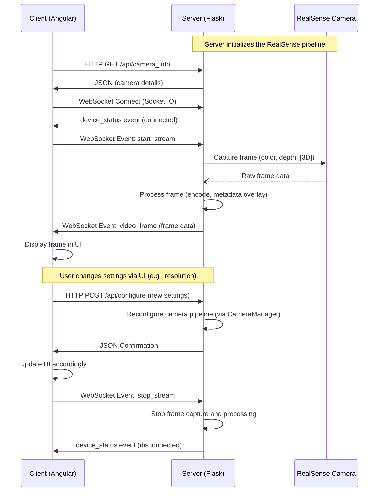

### Overview

The system consists of two main parts:

1. **Server (Flask Backend):**  
   - Connects directly to the Intel RealSense camera using the RealSense SDK.
   - Captures real-time frames (color, depth, and optionally 3D view).
   - Processes frames (encoding, adding metadata, etc.).
   - Exposes REST API endpoints for configuration and control (e.g., changing resolution, exposure).
   - Uses WebSocket (via SocketIO) to push live stream frames to connected clients.

2. **Client (Angular Frontend):**  
   - Provides an interactive web interface for the user.
   - Displays live video streams received from the server.
   - Contains UI elements (buttons, sliders, toggles) to configure camera settings.
   - Communicates with the server using REST API calls (for configuration like exposure or metadata toggles) and connects via WebSocket to receive continuous streaming data.

──────────────────────────────
### High-Level Interaction Flow

1. **Initial Setup:**
   - The server starts, initializes the RealSense pipeline, and waits for client connections.
   - The Angular client is served (using ng serve, or as a built production app) so that a user can access it via the browser.

2. **Client Connects to Server:**
   - When the client loads in the browser, it establishes a WebSocket connection with the server.
   - The client may issue an HTTP GET request (e.g., `/api/camera_info`) to fetch camera details.
   - The server responds with information about the camera (name, serial number, etc.), which the client displays (for example, in a sidebar).

3. **Starting Streaming:**
   - The user connects to the webviewer.
   - The client sends a WebSocket event (`start_stream`) to the server.
   - In response, the server starts its RealSense pipeline (if not already running) and then enters a loop where it captures frames.
   - For each captured frame, the server processes it (encoding to Base64, adding overlays/metadata) and emits a WebSocket event (`video_frame`) with the frame data.

4. **Displaying Frames:**
   - The Angular client's WebSocket service listens for the `video_frame` events.
   - When a new frame arrives, the client updates its UI (for example, in the CamStreamsComponent) with the image URLs (base64 strings) and metadata.
   - This creates a near-real-time video stream display in the browser.

5. **User Configuration Updates:**
   - If the user changes settings (e.g., resolution, exposure, metadata toggles) through the Angular app:
     - The client sends an HTTP POST request to a REST endpoint (e.g., `/api/configure` or `/api/exposure`) with the new settings.
     - The server receives the request, updates the internal configuration (using CameraManager methods), and reconfigures the pipeline accordingly.
     - The client may display a “reconfiguring…” overlay while waiting for changes to take effect.
   - Likewise, toggling metadata is handled via a POST request to `/api/set_metadata`.

6. **Stopping the Stream / Disconnect:**
   - If the user wishes to stop streaming, the client sends a `stop_stream` WebSocket event.
   - The server terminates the frame generation loop and stops the pipeline.
   - When the client disconnects (either manually or due to a network issue), cleanup is handled on both ends.

──────────────────────────────
### Diagram: Interaction Flow

Below is an example diagram (using simple ASCII/mermaid style) that illustrates the data flow between the client and server:

──────────────────────────────
### Summary

- **Initialization:**  
  Server sets up RealSense camera and starts listening for connections. Client loads, establishes a WebSocket connection, and fetches camera information.

- **Streaming:**  
  On user connection, the client instructs the server to start streaming. The server continuously processes frames from the camera and sends them via WebSocket, which the client displays in real time.

- **Configuration Updates:**  
  When the user interacts with the UI (e.g., changing resolution or exposure), the client sends HTTP requests to update the server’s configuration. These changes take effect in the RealSense pipeline and are reflected in subsequent video frames.

- **Disconnection:**  
  Stopping the stream or network disconnects result in cleanup on both the server and client sides.

──────────────────────────────
